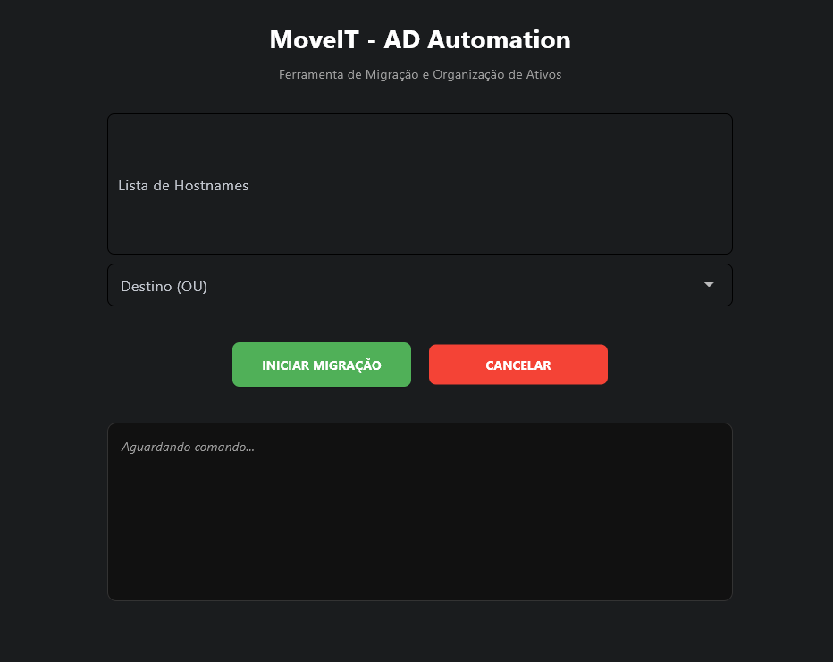

# 🚀 MoveIT - AD Automation & Telemetry Tool

---

## 📌 Problema de Negócio
No gerenciamento de infraestrutura (Active Directory), a movimentação manual de ativos gera um grave problema de **Governança de Dados**. O processo humano é suscetível a erros de digitação e classificações incorretas (movimentação para OUs erradas), o que polui a base de dados do diretório. Além disso, a execução manual é uma "caixa preta": não gera telemetria estruturada, impossibilitando a criação de métricas, dashboards ou futuras análises preditivas sobre o ciclo de vida dos ativos.

## 🎯 Objetivo do Projeto
Construir um pipeline automatizado de ponta a ponta (com interface gráfica) para a migração em massa de objetos no AD. O foco é garantir a **Qualidade dos Dados (Data Quality)** na entrada, executar as mudanças de forma segura e gerar um log estruturado (CSV) de todas as transações, criando a base de dados necessária para futuras análises de TI (AIOps/Dashboards).

## 🧠 Estratégia da Solução
A arquitetura foi desenhada inspirada em conceitos de **ETL (Extract, Transform, Load)** e Governança:
1. **Extract (Coleta):** Captura de dados brutos inseridos pelo usuário via interface.
2. **Transform (Sanitização):** Uso de *Expressões Regulares (Regex)* para limpar strings, remover caracteres ocultos e padronizar os hostnames, evitando o efeito *Garbage In, Garbage Out*.
3. **Load (Execução):** Orquestração assíncrona do PowerShell pelo Python para carregar as mudanças no banco de dados do AD de forma segura (validação prévia da existência do ativo).
4. **Telemetry (Observabilidade):** Geração automática de logs estruturados e padronizados com carimbo de tempo (Timestamp) para rastreabilidade de 100% das operações.

## 🛠️ Tecnologias Utilizadas
* **Python (3.12+):** Motor principal para tratamento de dados, manipulação de strings (Regex), I/O de arquivos e orquestração de processos.
* **Flet (Framework):** Criação da interface reativa.
* **JSON:** Estruturação e armazenamento de dicionários de dados (Mapeamento de caminhos LDAP).
* **PowerShell:** Backend de execução atuando como o "conector" para o Active Directory.
* **CSV Logging:** Persistência de dados estruturados para integração futura com ferramentas de BI.

## 🛤️ Etapas do Projeto
1. **Mapeamento de Requisitos e Dicionário de Dados:** Mapeamento dos caminhos LDAP complexos para um arquivo `config.json`, criando uma camada semântica amigável para o usuário final.
2. **Desenvolvimento do Motor de Tratamento (Data Prep):** Criação de funções de limpeza de strings para garantir que anomalias nos dados de entrada (espaços, caracteres especiais) não quebrassem o pipeline.
3. **Orquestração Python-PowerShell:** Implementação do módulo `subprocess` para enviar comandos validados ao sistema operacional.
4. **Implementação de Telemetria:** Criação de um gerador de logs em `.csv` que captura o *hostname*, *status* da operação e *timestamp*.
5. **Empacotamento (Deploy):** Criação de um pipeline automatizado via `.bat` para compilar o código em um executável (.exe) independente.

## 💡 Principais Insights
* **A importância do Data Cleansing:** A maior causa de falhas em automações são dados de entrada não padronizados. Implementar a sanitização via Regex reduziu as falhas de execução a zero.
* **Validação antes da Inserção (Pre-flight check):** Consultar o AD para confirmar a existência do ativo antes de tentar movê-lo funcionou como uma regra de integridade referencial, economizando processamento e evitando logs de erros desnecessários.
* **Dados geram valor além da automação:** O arquivo `historico_log.csv` gerado não serve apenas para auditoria imediata. Ele é um dado estruturado que agora pode ser ingerido em ferramentas como Power BI ou Tableau para analisar o volume de movimentações, gargalos operacionais e picos de demanda no Service Desk.

## 📈 Resultados
* **Confiabilidade da Base (Data Governance):** Fim das movimentações acidentais, garantindo que o banco de dados do AD reflita a realidade física da empresa.
* **Desempenho (Performance):** Redução do tempo de processamento de lotes massivos de horas para segundos, liberando tempo da equipe técnica.
* **Rastreabilidade (Audit Trail):** Passamos de 0% para 100% de visibilidade sobre as movimentações, com um log padronizado pronto para análise de dados.

## 🏁 Conclusão
O **MoveIT** demonstra que os princípios de Engenharia de Dados se aplicam a qualquer automação de processos. Antes de pensarmos em IA ou análises avançadas na gestão de TI (AIOps), precisamos de processos padronizados, dados de entrada higienizados e telemetria estruturada. Este projeto é o alicerce metodológico que transforma uma tarefa manual arriscada em um fluxo de dados seguro, auditável e eficiente.

Desenvolvido por George GS Matos / https://www.linkedin.com/in/george-gs-matos/
